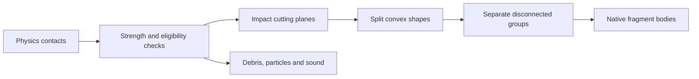

# Glass shattering

**CONFIRMED: static analysis of the supplied 1.5.14 x86_64 library:** the breakage path creates new convex geometry and native physics bodies at runtime. It uses contact results, material strength, geometric cutting planes and connectivity checks. The visible effect also includes separate debris, particles and sound.

This page describes the inspected implementation. We have not recovered the original source repository or experimentally characterized every glass material and fracture pattern. Exported symbols and control flow are stronger evidence here than Ghidra's inferred argument names, several of which are incorrect.

## From an obstacle to a breakable body

Obstacle Lua creates a Body and adds shapes with material properties. For example, the bundled `obstacles/scoretop.lua` selects glass and creates a scaled pyramid mesh. A body can contain several convex shapes; it is not necessarily a single rendered triangle mesh. Static room meshes and their collision boxes are another path and should not all be described as breakable glass.

**CONFIRMED (static):** `Body::isBreakable` checks the shapes' strength field. The unbreakable sentinel in this binary is the largest finite 32-bit float, approximately `3.4028235e38`. This is a gameplay strength threshold, not a physical simulation of molecular glass structure.

## An impact triggers geometric work

`Physics::processBreakage` examines the contact arrays produced by the physics step. It sums a contact-result quantity and compares it with each participating shape's strength threshold. **LIKELY:** that quantity is accumulated normal impulse; its complete solver data lineage has not yet been independently annotated. Calling it impact energy in joules would be unjustified.

**CONFIRMED (static):** the routine queues eligible bodies once per pass and requires their age field to exceed `0.5`. The queue stores the contact location, direction and strength used by the cutting routine. The standard call supplies `0.25` as the local impact-region parameter. That is an original constant in this call, not a promise that every hole has a radius of exactly 25 centimetres.

The impact overload of `breakBody` transforms the contact point and direction into the body's local coordinates. It builds six cutting planes around that local region. Plane construction includes calls to `QiVec3::random(0.3)`, so the geometry is not merely a fixed prerecorded shatter animation. The exact random-number distribution, seed consumption and reproducibility across builds remain **UNKNOWN**.

## Cutting the shapes

`splitShapes` walks the selected shapes and the plane list. It tests signed vertex distances and only cuts shapes that straddle the relevant plane sufficiently. In this path, the opposing distance tolerances are approximately `+0.06` and `-0.06`; this avoids splitting arbitrarily thin slivers at every near-coplanar intersection.

`Polyhedron::split` produces geometry on both sides of a plane. It classifies vertices, creates intersection vertices on crossing edges, builds the resulting face loops, and adds faces along the cut. Those cap faces have opposite plane normals in the two results. It reconnects edges and triangulates the resulting polyhedra. New Shape instances inherit properties from the old shape.

**CONFIRMED (static):** these are actual convex polyhedra used by the body/shape system. The primary breakage path is not only a texture crack or an emitter hiding an unchanged collider. No Voronoi-cell generation has been identified in the inspected cutting path; describing this implementation as Voronoi destruction would currently be unsupported.

The impact routine partitions the resulting shapes using distance to the impact region. It can retain some on the original body and put others on a clone. `breakBodySplit` provides an additional single-plane split through the impact region, with a randomized plane direction, including a fallback when the first operation does not produce a useful division. Empty results are handled without retaining an empty fragment body.

## Detached pieces become bodies

**CONFIRMED (static):** `checkConnectivity` first checks shape bounds and then a shape-distance function. It groups shapes that remain connected. Disconnected groups are moved onto separate cloned bodies. Consequently, cutting a connecting part can detach a larger remaining piece rather than requiring every triangle to become an independent particle.

`Body::cloneWithoutShapes` uses the original Level entity factory, copies the body pose and motion-related state, and retains its obstacle association where present. The split paths call `Body::computeMassProperties` on the resulting bodies. The fragment's mass properties therefore follow its new shape geometry. Joint-handling code compares joint anchors with candidate bodies using `getClosestPoint` before reassigning endpoints; the complete behavior of every joint type after fracture remains **UNKNOWN**.

The larger fragments use the ordinary native body/shape/solver machinery. Separately, `Physics::processBreakage` invokes `Debris::spawn` and `ParticleSystem::spawn`, plays a sound, and updates applicable broken-object/scoring state. Not every sparkling fleck should therefore be counted as a full rigid body. Their exact allocation budgets and material-specific visual lifetimes have not yet been measured.

## Why the result works well

**INTERPRETATION:** convex geometry gives the collision solver manageable shapes; local cuts and connectivity make the result respond to the hit; cheaper visual debris and sound fill in the small detail. It is more capable than a fixed shatter animation while avoiding a general structural-stress simulation.

The original game's cleanup is designed for forward travel. Physics removal, entity destruction and draw culling are distinct, and fragments are not a permanent record of the whole run. See [physics](physics.md), [streaming](level_streaming.md), and the separately measured [ball lifecycle](ball_lifecycle.md). The first-person projectile-lifetime exception applies to player balls, not to all broken glass.

## Evidence and remaining experiments

Private local evidence: `analysis/decompiled/glass-x86_64/`, `analysis/decompiled/glass-helpers-x86_64/`, `analysis/reports/glass-decompile.log`, `analysis/reports/glass-helpers-decompile.log`, and `analysis/reports/glass-constants-x86_64.json`. Ghidra addresses include its `0x100000` import base; subtract that for an ELF-relative address.

| Native function | ELF-relative address, x86_64 |
| --- | --- |
| `Body::cloneWithoutShapes` | `0x273910` |
| `Body::isBreakable` | `0x273fb0` |
| `breakBodySplit` | `0x2749d0` |
| Impact overload of `breakBody` | `0x275720` |
| `splitShapes` | `0x276ee0` |
| `checkConnectivity` | `0x277cc0` |
| `Physics::processBreakage` | `0x28dec0` |
| `Polyhedron::split` | `0x292950` |

These addresses belong only to build ID `ac3b897010a22367c4829bf6429e90e74f5b0fce`. They must not be transferred to Granny Smith, PinOut or another Smash Hit build. This investigation has not modified the fracture algorithm. Next useful experiments are reproducible impact positions, before/after body and topology counts, connected-versus-disconnected panes, and fragment cleanup with a stationary player.
